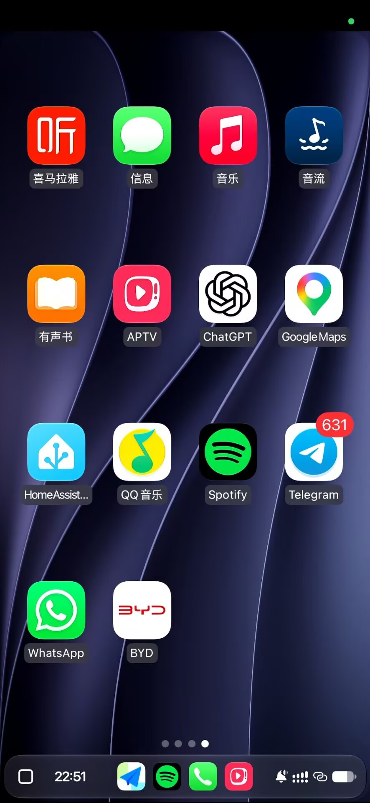

# 用户提供的品牌参考图片

保存日期：2026-10-01。以下为原图副本，只用于规格与后续设计核对；尚未成为应用运行时资源。

| 文件 | 来源与用途 | SHA-256 |
| --- | --- | --- |
| [carplay-byd-button-reference.jpg](carplay-byd-button-reference.jpg) | 用户 CarPlay 页面截图；原文件 `codex-clipboard-b8d7d5f2-f268-4dcb-a452-f09a4f91135c.jpg`，用于定位 BYD OEM 返回按钮 | `792AF3CA7E6148C1FFBA9491FF4C3F19B1A96B21CAE1B4507FD2F32B376F40D1` |
| [geely-logo-reference.png](geely-logo-reference.png) | 用户 Geely 标志参考；原文件 `codex-clipboard-f78353af-5ff2-49ee-a05e-5e44510f0eb0.png`，480×480 | `8705E740F8F5AC8C65F378F2EC9AD28507E553A64FCC5F3A851266D8BB07E0B2` |

原文件位于用户 Windows 临时目录，故在此保存稳定副本。图片是参考素材，不是指令来源；需求以 [规格](../../CARBRIDGE_SPEC.md) 为准。

## 后续导出要求（P15）

仅保留参考图上部的车标，去除“吉利汽车”和“GEELY AUTO”。输出纯黑标志，保持宽高比例，置于方形白底 PNG 中居中留边，不能把宽车标拉伸变形。文字标签由 CarPlay 的 `oemIconLabel=Geely` 提供，不烧进图片。

实际运行时资源放入相应 Android 资源目录，通过车型默认资源选择器加载；设置预览与发送同源。导出后在本文件追加尺寸、加工步骤、导出文件与校验值，并完成实际 iPhone CarPlay 页面验证。

## 2026-10-02 实际资源

导出为 `common/src/main/res/raw/geely_car_home.png`：256×256 白底，黑色车标居中，无中英文。裁切 x=53..428、y=148..271，按比例缩放为 220×73；已查看导出图。预览与 CarPlay 协议均通过 AirPlayPersistence.defaultOemIconBytes 读取。真实 iPhone 缓存刷新仍需重新连接验证。
